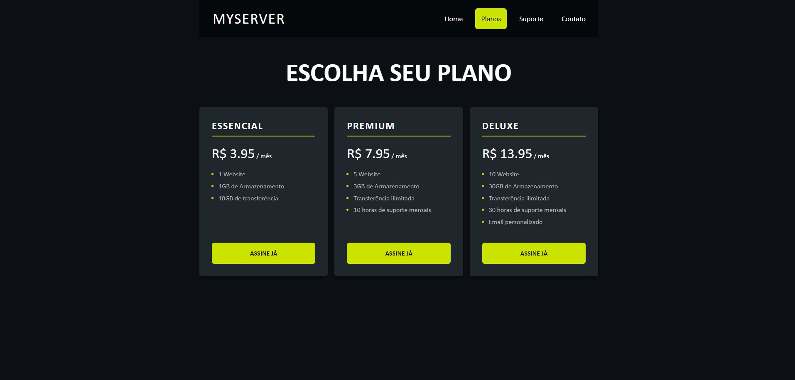

# Site de Planos Promocionais de Internet

Este projeto foi desenvolvido utilizando HTML5 e CSS para criar um site simples, mas eficaz, que apresenta planos promocionais de internet.

Sinta-se à vontade para baixar o projeto e testá-lo localmente!
## Imagem do projeto

## Como Contribuir

Se você deseja contribuir para este projeto, siga estas etapas:

1. Faça um fork do repositório.
2. Crie sua própria branch: `git checkout -b feature/sua-feature`.
3. Faça suas alterações e commit: `git commit -am 'Adicione sua feature'`.
4. Faça push para a branch: `git push origin feature/sua-feature`.
5. Envie um pull request.

## Licença

Este projeto está licenciado sob a [Licença MIT](LICENSE).

---

**Nota:** Este projeto é apenas para fins educacionais e de demonstração.
